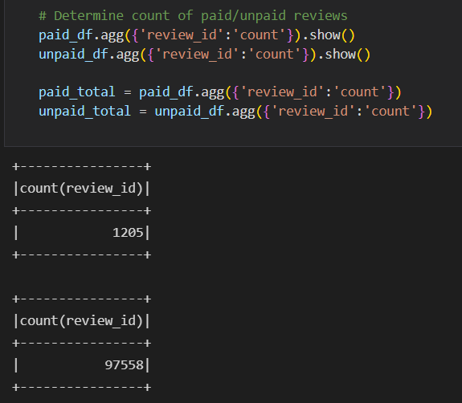
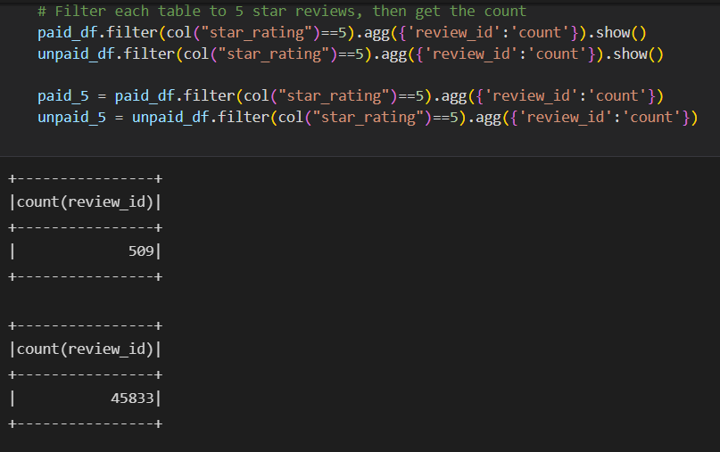
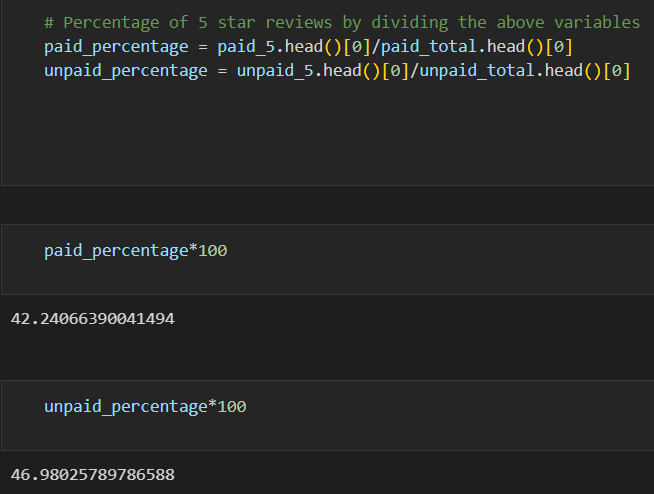
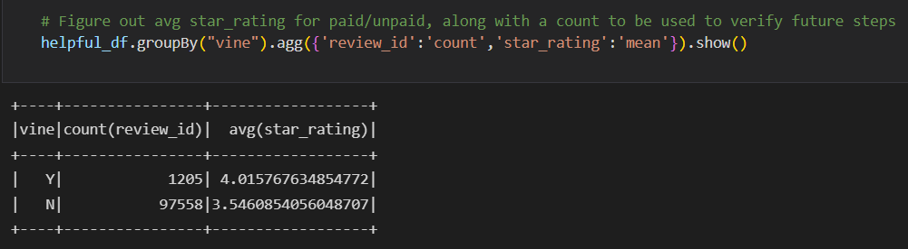

# Amazon_Vine_analysis

## Overview
<!-- Overview of the analysis of the Vine program:
The purpose of this analysis is well defined (3 pt) -->
**Purpose:**
The purpose of the following analysis is to determine whether any bias in present in five-star reviews of paid members of the Amazon Vine review program. To accomplish this analysis it was necessary to filter Amazon reviews based on whether the reviewer was a member of the paid Vine program. Then those filtered dataframes were analyzed to ascertain the amounts necessary to calculate percentages of five-star reviews among both categories of reviewer.

<!-- There is a bulleted list that addresses the three questions for unpaid and paid program reviews (7 pt) -->
**Summary**
* To find the percentages of five-star reviews it was first necessary to find the total amount of review in each category. To begin the process it was required that the original dataframe was split apar into reviewers whose 'Vine' value was 'Y' (i.e. Paid reviewers) and reviewers whose 'Vine' value was 'N' (i.e. Unpaid reviewers). These dataframes had to be saved under new variable names, as the original dataframe created by Spark is immutable, so dataframes named 'paid_df' and 'unpaid_df' were saved with the results of the two filters described above.

Now to acquire the amount of total reviewers, code was written to gather an aggregate count of the unique 'review_id' values present in each filtered dataframe. That code can be viewed below. It found that there are 1,205 reviews by members of the Vine program, and a much larger 97,558 unpaid reviews. In future calculations this number will be used as the denominator to find the percentage of five-star reviews for each category.

**FIGURE 1: THE TOTAL AMOUNT OF PAID AND UNPAID REVIEWS**

* The next step in finding the percentages of five-star reviews is to actually acquire the total amount of five-star reviews for each category of review. Using code that was very similar, an aggregate count function was used on the 'review_id' again to count the number of reviews. This time though, the previously created dataframes (paid_df and unpaid_df) were given an additional filter to *ONLY* select review rows where the 'star_rating' value was equal to 5. This limits the returned rows to only the five-star reviews. The returned dataframes state that 509 of the paid reviews were five-stars, while again a much larger value of 45,833 unpaid reviews had five-stars. The code and results of the described code can be viewed below in Fig. 2.

**FIGURE 2: THE AMOUNT OF FIVE-STAR PAID AND UNPAID REVIEWS**

* Finally the results obtained above were divided to find the percentage of reviews in each category which were five-stars. These calculations determined that roughly 42% of paid reviews were five-star reviews while 47% of unpaid reviews were five-star reviews. The conclusion to be drawn from these values would support the idea that there **is not** bias shown towards five-star reviews solely based on whether a reviewer is part of the paid Vine Review program.

**FIGURE 3: PERCENTAGE DISTRIBUTION OF PAID AND UNPAID FIVE-STAR REVIEWS**

<!-- The summary states whether or not there is bias, and the results support this statement (2 pt)

An additional analysis is recommended to support the statement (2 pt) -->
* An additional analysis worth performing would be to also consider the average star rating of a review in each category. To obtain an answer to this question, we can return back to step 1 when we have a cleaned dataframe called "helpful_df", before it has been split into different categories based on Vine participation. A quicker method of obtaining these results is to take this un-split dataframe and used the .groupby() method to group reviews based on their 'vine' value (as opposed to invidiually creating the paid_df and unpaid_df then filtering those newly saved dataframes as needed). Aggregate functions performed on the two groups of 'vine' values returned both a count (which matches previously obtained results) and the average value of the 'star_rating' column. These results potentially suggest a small bias, as the paid reviews have an average star rating which is 0.47 points higher than unpaid reviews. If there is a bias it appears to be a very weak one however, as those same numbers could both be rounded to the same integer (4) using standard rounding methods.

